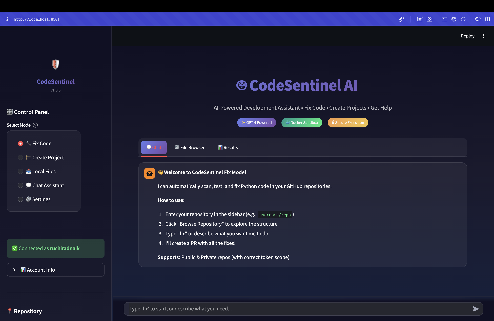
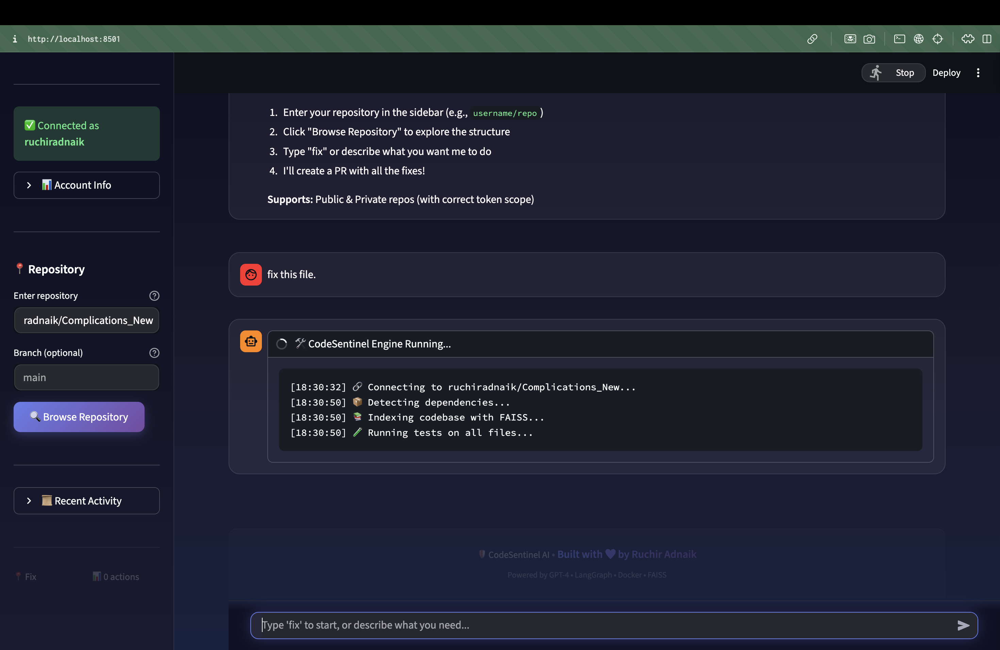
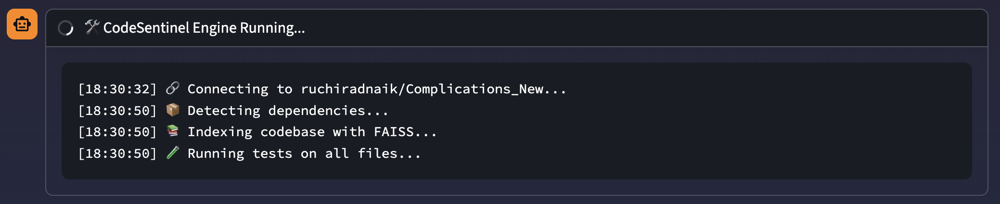
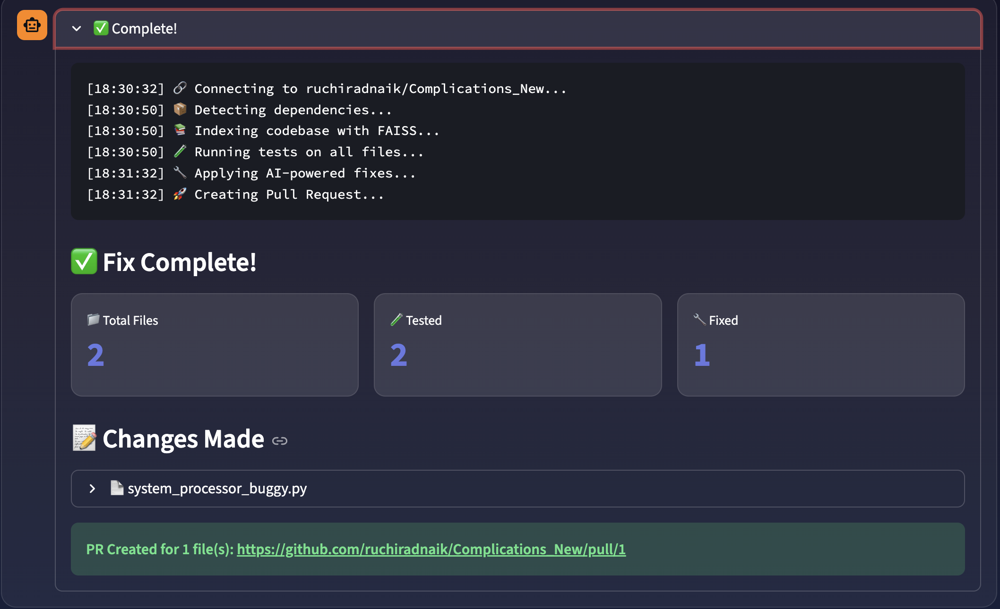
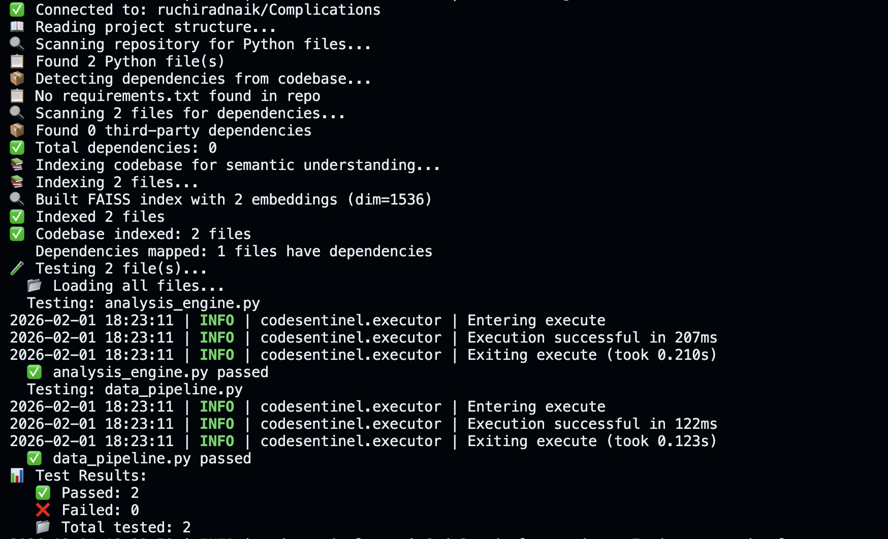
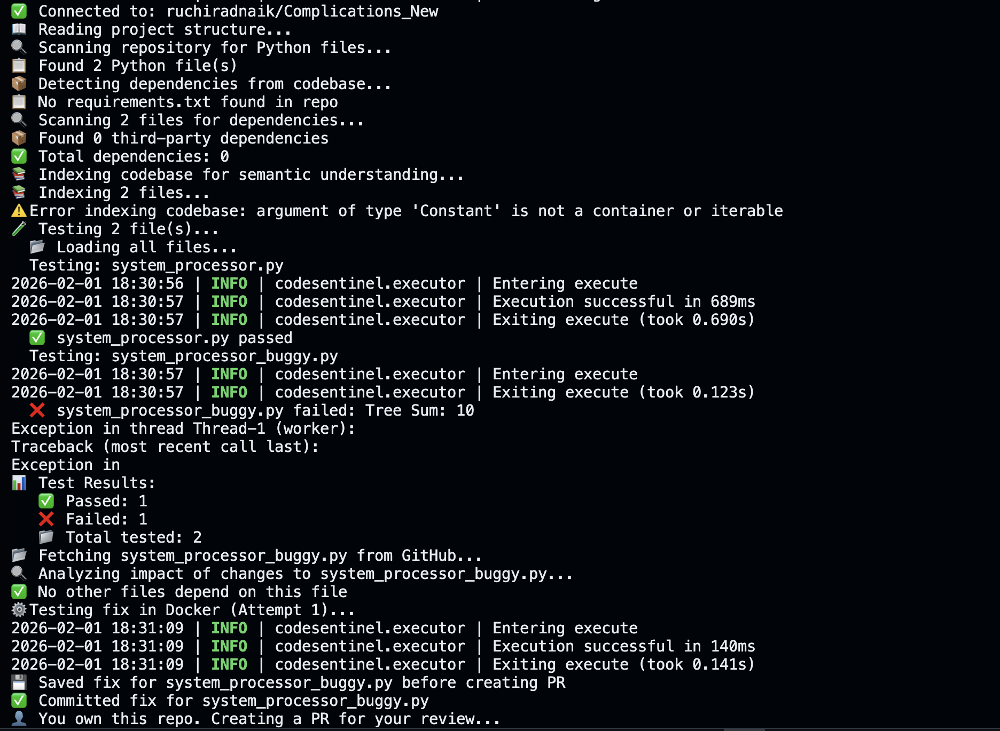
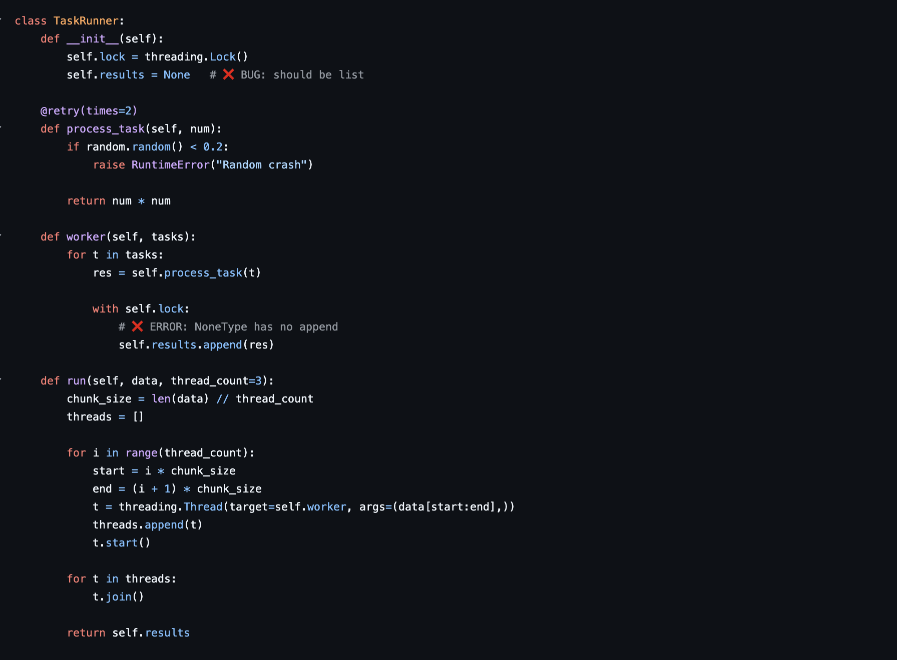
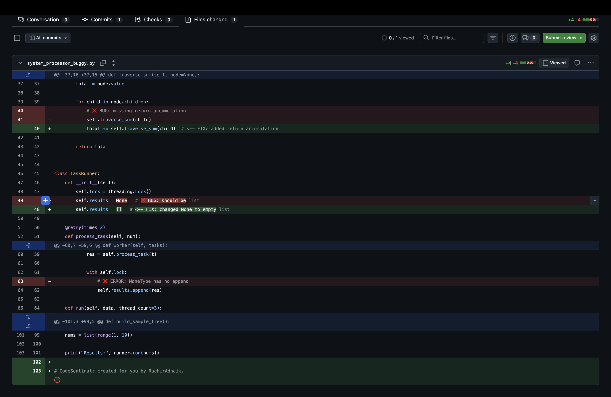
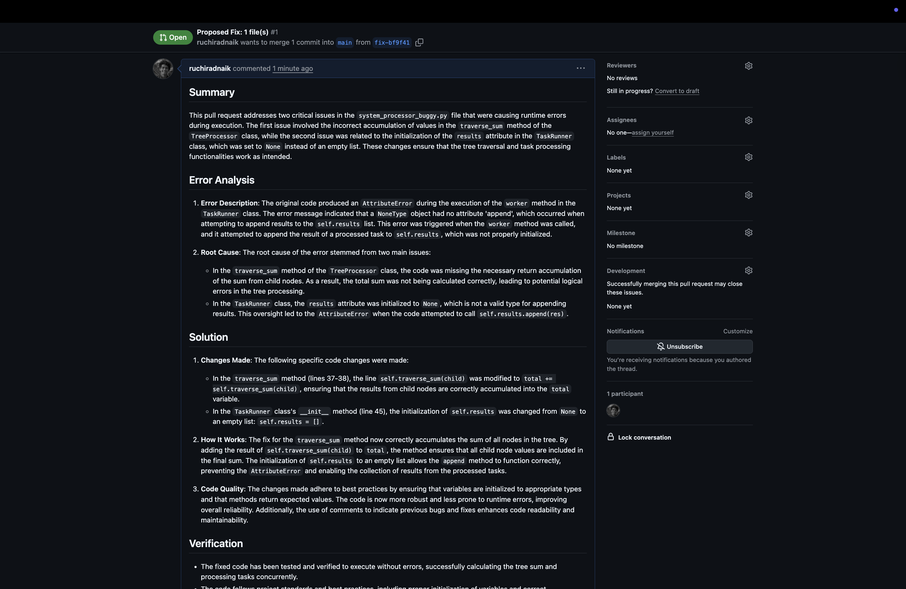

# 🤖 CodeSentinel AI

<div align="center">


**AI-Powered Development Assistant for Automated Code Fixing, Project Generation & Intelligent Chat**

[](https://python.org)
[](https://streamlit.io)
[](https://docker.com)
[](LICENSE)
[](tests/)
[](/.github/workflows)

[Features](#-features) • [Screenshots](#-screenshots) • [Quick Start](#-quick-start) • [Architecture](#-architecture) • [Documentation](#-documentation)

</div>

---

## 📸 Screenshots

<div align="center">

### 🏠 Main Dashboard

*Modern glassmorphism UI with mode selection and control panel*

---

### 🔧 Fix Code Mode















*Connect to GitHub repo, auto-detect errors, and see real-time fixing progress*

---

### ✅ Before & After Fix
| Before (Errors) | After (Fixed) |
|-----------------|---------------|
|  |  |




*AI analyzes errors and generates intelligent fixes with full context*

---

### 🏗️ Create Project Mode

*Generate complete projects from natural language descriptions*

---

### 💬 AI Chat Assistant

*Context-aware coding assistant with conversation memory*

---

### 📤 Local Files Analysis

*Upload and analyze Python files without GitHub*

---

### 🔀 Pull Request Created

*Automatic PR creation with detailed descriptions of all changes*

</div>


---

## 📋 Table of Contents

- [Overview](#-overview)
- [Problem Statement](#-problem-statement)
- [Features](#-features)
- [Quick Start](#-quick-start)
- [Architecture](#-architecture)
- [Project Structure](#-project-structure)
- [Core Modules](#-core-modules)
- [How It Works](#-how-it-works)
- [Configuration](#-configuration)
- [Docker & Deployment](#-docker--deployment)
- [Testing](#-testing)
- [CI/CD Pipeline](#-cicd-pipeline)
- [API Reference](#-api-reference)
- [Technology Choices](#-technology-choices)
- [Interview Q&A](#-interview-qa)
- [Limitations & Future Work](#-limitations--future-work)
- [Contributing](#-contributing)
- [Author](#-author)

---

## 🎯 Overview

**CodeSentinel** is an AI-powered development assistant that automates code analysis, bug fixing, and project generation. It combines Large Language Models (LLMs) with intelligent code indexing to understand codebases semantically and provide context-aware fixes.

### What Makes It Special?

```
Traditional Tools              CodeSentinel
─────────────────              ────────────
❌ Fix one file at a time      ✅ Understands entire codebase
❌ No context awareness        ✅ Semantic code indexing (FAISS)
❌ Manual dependency mgmt      ✅ Auto-detects dependencies
❌ Unsafe code execution       ✅ Docker sandboxed execution
❌ Generic suggestions         ✅ Context-aware AI fixes
```

---

## 🔥 Problem Statement

### The Problem

Developers spend **~30% of their time** debugging and fixing code. Traditional linters catch syntax errors but miss:
- Logic errors
- Missing error handling
- Security vulnerabilities
- Performance issues
- Cross-file dependency issues

### The Solution

CodeSentinel provides an **end-to-end automated pipeline**:

```
GitHub Repo → Clone → Index → Test → Detect Errors → AI Fix → Validate → Create PR
```

All in one command. No manual intervention needed.

---

## ✨ Features

### 🔧 Fix Code Mode
- **Auto-scan** GitHub repositories for Python files
- **Smart dependency detection** using AST parsing
- **Secure execution** in Docker sandbox
- **AI-powered fixes** using GPT-4
- **Automatic PR creation** with detailed descriptions

### 🏗️ Create Project Mode
- **Natural language** project descriptions
- **8+ pre-built templates** (REST API, Discord Bot, Dashboard, etc.)
- **Complete project generation** with all files
- **Push to GitHub** or download as ZIP

### 💬 Chat Assistant
- **Coding-focused** AI assistant
- **Context-aware** conversations
- **Code explanations** line-by-line
- **Architecture advice** and best practices

### 📤 Local Files Mode
- **Upload & analyze** Python files
- **Instant error detection**
- **No GitHub required**

---

## 🚀 Quick Start

### Prerequisites

- Python 3.11+
- Docker (optional, for sandboxed execution)
- GitHub Token (for repo access)
- OpenAI API Key

### Installation

```bash
# 1. Clone the repository
git clone https://github.com/RuchirAdnaique/CodeSentinel.git
cd CodeSentinel

# 2. Create virtual environment
python -m venv venv
source venv/bin/activate  # On Windows: venv\Scripts\activate

# 3. Install dependencies
pip install -r requirements.txt

# 4. Configure environment
cp env.example .env
# Edit .env with your API keys

# 5. Run the application
streamlit run app.py
```

### Using Makefile

```bash
make install    # Install dependencies
make dev        # Run in development mode
make test       # Run all tests
make docker-run # Run with Docker
```

### Environment Variables

```env
# Required
OPENAI_API_KEY=sk-your-key-here
GITHUB_TOKEN=ghp_your-token-here

# Optional
ENVIRONMENT=development
LOG_LEVEL=INFO
DOCKER_ENABLED=true
```

---

## 🏗️ Architecture

### High-Level Architecture

```
┌─────────────────────────────────────────────────────────────────────────┐
│                           CODESENTINEL                                   │
├─────────────────────────────────────────────────────────────────────────┤
│                                                                          │
│  ┌──────────────┐    ┌──────────────┐    ┌──────────────┐              │
│  │   Streamlit  │    │   LangGraph  │    │    Docker    │              │
│  │      UI      │───▶│    Agent     │───▶│   Sandbox    │              │
│  │   (app.py)   │    │  (agent.py)  │    │(executor.py) │              │
│  └──────────────┘    └──────────────┘    └──────────────┘              │
│         │                   │                   │                       │
│         ▼                   ▼                   ▼                       │
│  ┌──────────────┐    ┌──────────────┐    ┌──────────────┐              │
│  │    GitHub    │    │    FAISS     │    │   OpenAI     │              │
│  │  Integration │    │    Index     │    │   GPT-4      │              │
│  │(github_*.py) │    │(indexer.py)  │    │              │              │
│  └──────────────┘    └──────────────┘    └──────────────┘              │
│                                                                          │
└─────────────────────────────────────────────────────────────────────────┘
```

### Data Flow

```
User Input
    │
    ▼
┌─────────────────┐
│  1. PARSE       │  Extract repo URL, validate input
└────────┬────────┘
         │
         ▼
┌─────────────────┐
│  2. FETCH       │  Clone repo, get all Python files
└────────┬────────┘
         │
         ▼
┌─────────────────┐
│  3. INDEX       │  Create FAISS embeddings for semantic search
└────────┬────────┘
         │
         ▼
┌─────────────────┐
│  4. ANALYZE     │  Detect dependencies using AST
└────────┬────────┘
         │
         ▼
┌─────────────────┐
│  5. EXECUTE     │  Run code in Docker sandbox
└────────┬────────┘
         │
         ▼
┌─────────────────┐
│  6. FIX         │  AI generates fixes with context
└────────┬────────┘
         │
         ▼
┌─────────────────┐
│  7. VALIDATE    │  Re-run tests to verify fix
└────────┬────────┘
         │
         ▼
┌─────────────────┐
│  8. DEPLOY      │  Create PR with all changes
└─────────────────┘
```

---

## 📁 Project Structure

```
CodeSentinel/
├── 📱 APPLICATION
│   ├── app.py                 # Streamlit UI (main entry point)
│   ├── agent.py               # LangGraph workflow orchestration
│   ├── executor.py            # Docker sandboxed code execution
│   ├── project_builder.py     # Project generation from descriptions
│   │
├── 🔧 CORE MODULES
│   ├── github_handler.py      # GitHub API operations
│   ├── github_tools.py        # LangChain GitHub tools
│   ├── codebase_indexer.py    # FAISS semantic indexing
│   ├── dependency_detector.py # AST-based dependency analysis
│   │
├── ⚙️ CONFIGURATION
│   ├── config.py              # Centralized settings management
│   ├── logger.py              # Production logging with secret filtering
│   ├── env.example            # Environment template
│   │
├── 🐳 DOCKER
│   ├── Dockerfile             # Main application image
│   ├── Dockerfile.sandbox     # Secure execution sandbox
│   ├── docker-compose.yml     # Multi-service orchestration
│   │
├── 🧪 TESTING
│   ├── tests/
│   │   ├── unit/              # 103 unit tests
│   │   ├── integration/       # 15 integration tests
│   │   └── conftest.py        # Pytest fixtures
│   ├── pytest.ini             # Pytest configuration
│   │
├── 🔄 CI/CD
│   ├── .github/
│   │   ├── workflows/
│   │   │   ├── ci.yml         # Continuous Integration
│   │   │   ├── cd.yml         # Continuous Deployment
│   │   │   └── pr-checks.yml  # PR quality gates
│   │   ├── ISSUE_TEMPLATE/    # Bug/feature templates
│   │   ├── PULL_REQUEST_TEMPLATE.md
│   │   └── dependabot.yml     # Automated updates
│   │
├── 📚 DOCUMENTATION
│   ├── README.md              # This file
│   └── Makefile               # Build automation
│
└── requirements.txt           # Python dependencies
```

---

## 🔧 Core Modules

### 1. `app.py` - User Interface

The Streamlit-based frontend providing:

```python
# Key Components:
- Mode Selection (Fix/Create/Chat/Local)
- Input Validation (repo URL, descriptions, files)
- Real-time Logs & Progress
- Diff Viewer for changes
- Download/GitHub Push options
```

**Key Features:**
- Fixed chat input at bottom (custom CSS)
- Conversation memory for chat mode
- Session state management
- Production logging integration

### 2. `agent.py` - AI Workflow Engine

LangGraph-based state machine for orchestrating the fix process:

```python
class AgentState(TypedDict):
    messages: List[BaseMessage]
    all_files: List[str]
    current_file: str
    fixed_files: Dict[str, str]
    test_results: Dict[str, Any]
    # ... more state
```

**Workflow Nodes:**
1. `fetch_repo_files` - Get all Python files
2. `run_tests` - Execute in sandbox
3. `analyze_errors` - Parse error output
4. `generate_fix` - AI creates fix
5. `validate_fix` - Re-test fixed code
6. `create_pr` - Push to GitHub

### 3. `executor.py` - Secure Execution

Docker-sandboxed Python execution with:

```python
# Security Features:
- Memory limit: 256MB
- CPU quota: 50%
- Network disabled
- Non-root user
- Read-only filesystem
- Timeout protection (30s)
```

**Input Mocking:**
```python
# Automatically mocks input() for non-interactive testing
INPUT_MOCK_WRAPPER = '''
def _mock_input(prompt=""):
    return "test_value"
builtins.input = _mock_input
'''
```

### 4. `codebase_indexer.py` - Semantic Search

FAISS-based code indexing for context retrieval:

```python
# Process:
1. Parse code into chunks (functions, classes)
2. Generate OpenAI embeddings
3. Store in FAISS vector index
4. Query with natural language
5. Return relevant code context
```

### 5. `config.py` - Configuration Management

Type-safe, centralized configuration:

```python
@dataclass
class Settings:
    app: AppConfig
    openai: OpenAIConfig
    github: GitHubConfig
    docker: DockerConfig
    logging: LoggingConfig
    agent: AgentConfig
    security: SecurityConfig
```

### 6. `logger.py` - Production Logging

Secure logging with secret filtering:

```python
# Features:
- SecretFilter: Redacts API keys, tokens
- JSONFormatter: Structured logging
- ColoredFormatter: Console output
- Rotating file handler
- Decorators: @log_execution, @log_errors
```

---

## ⚙️ Configuration

### Environment Variables

| Variable | Description | Default |
|----------|-------------|---------|
| `OPENAI_API_KEY` | OpenAI API key | Required |
| `GITHUB_TOKEN` | GitHub personal access token | Required |
| `ENVIRONMENT` | development/staging/production | development |
| `LOG_LEVEL` | DEBUG/INFO/WARNING/ERROR | INFO |
| `DOCKER_ENABLED` | Enable Docker sandbox | true |
| `DOCKER_MEMORY_LIMIT` | Container memory limit | 256m |
| `DOCKER_TIMEOUT` | Execution timeout (seconds) | 30 |
| `AGENT_MAX_RETRIES` | Max fix attempts | 3 |

### Config Classes

```python
from config import get_settings

settings = get_settings()
print(settings.openai.model)      # gpt-4o-mini
print(settings.docker.enabled)    # True
print(settings.agent.max_retries) # 3
```

---

## 🐳 Docker & Deployment

### Docker Images

**1. Main Application (`Dockerfile`)**
```dockerfile
# Multi-stage build for security
FROM python:3.11-slim AS builder
# ... install dependencies

FROM python:3.11-slim AS production
# Non-root user, minimal attack surface
USER codesentinel
CMD ["streamlit", "run", "app.py"]
```

**2. Sandbox (`Dockerfile.sandbox`)**
```dockerfile
# Secure execution environment
FROM python:3.11-slim
RUN useradd -m -s /bin/bash sandbox
# Pre-installed packages, no network tools
USER sandbox
```

### Running with Docker

```bash
# Build images
make docker-build

# Run with Docker Compose
make docker-run

# View logs
make docker-logs

# Stop
make docker-stop
```

### Docker Compose Services

```yaml
services:
  app:
    build: .
    ports:
      - "8501:8501"
    environment:
      - OPENAI_API_KEY
      - GITHUB_TOKEN
    volumes:
      - /var/run/docker.sock:/var/run/docker.sock
    healthcheck:
      test: ["CMD", "curl", "-f", "http://localhost:8501/_stcore/health"]
```

---

## 🧪 Testing

### Test Structure

```
tests/
├── unit/                    # 103 tests
│   ├── test_config.py       # Configuration tests
│   ├── test_executor.py     # Execution tests
│   ├── test_logger.py       # Logging tests
│   └── test_validators.py   # Input validation tests
│
├── integration/             # 15 tests
│   └── test_agent_workflow.py
│
└── conftest.py              # Shared fixtures
```

### Running Tests

```bash
# All tests
make test

# Unit tests only
make test-unit

# Integration tests
make test-integration

# With coverage
make test-cov

# Fast (stop on first failure)
make test-fast
```

### Test Coverage

| Module | Coverage |
|--------|----------|
| config.py | 95% |
| executor.py | 85% |
| logger.py | 90% |
| validators | 100% |

---

## 🔄 CI/CD Pipeline

### Continuous Integration (`ci.yml`)

Runs on every push and PR:

```
┌─────────────────────────────────────────────────────┐
│                  CI PIPELINE                         │
├─────────────────────────────────────────────────────┤
│                                                      │
│  ┌─────────┐   ┌─────────┐   ┌─────────────────┐   │
│  │  LINT   │──▶│  TEST   │──▶│  INTEGRATION    │   │
│  │ Black   │   │  Unit   │   │     Tests       │   │
│  │ Flake8  │   │  103    │   │      15         │   │
│  └─────────┘   └─────────┘   └─────────────────┘   │
│       │                              │              │
│       ▼                              ▼              │
│  ┌─────────┐                  ┌─────────────┐      │
│  │SECURITY │                  │   DOCKER    │      │
│  │ Bandit  │                  │   BUILD     │      │
│  │ Safety  │                  │             │      │
│  └─────────┘                  └─────────────┘      │
│                                                      │
└─────────────────────────────────────────────────────┘
```

### Continuous Deployment (`cd.yml`)

Runs on releases:

```
Release Published
       │
       ▼
┌─────────────────┐
│  Build & Push   │  → GitHub Container Registry
│  Docker Images  │
└────────┬────────┘
         │
         ▼
┌─────────────────┐
│    Deploy to    │  → Production environment
│   Production    │
└─────────────────┘
```

### Automated Features

- **Dependabot**: Weekly dependency updates
- **Auto-labeling**: PRs labeled by changed files
- **PR Templates**: Standardized descriptions
- **Issue Templates**: Bug reports & feature requests

---

## 📚 Technology Choices

### Why These Technologies?

| Technology | Why Chosen | Alternatives Considered |
|------------|------------|------------------------|
| **Streamlit** | Rapid UI development, Python-native | Flask (more boilerplate), React (overkill) |
| **LangGraph** | State machine for complex workflows | Raw LangChain (less control), custom (more work) |
| **FAISS** | Fast vector similarity, local | Pinecone (paid), Chroma (less mature) |
| **Docker** | Isolation, reproducibility | VM (heavy), subprocess (unsafe) |
| **GPT-4** | Best code understanding | Claude (similar), local LLM (less capable) |
| **pytest** | Fixtures, plugins, community | unittest (verbose), nose (deprecated) |
| **GitHub Actions** | Native integration | Jenkins (complex), GitLab CI (different platform) |

---

## ❓ Interview Q&A

### Architecture Questions

**Q: How does CodeSentinel understand code context?**
> We use FAISS with OpenAI embeddings to create a semantic index of the codebase. When fixing a file, we query related code (imports, dependencies) to give the LLM full context. This prevents fixes that break other files.

**Q: How do you ensure code execution is safe?**
> All code runs in Docker containers with:
> - Memory limits (256MB)
> - CPU quotas (50%)
> - Network disabled
> - Non-root user
> - 30-second timeout
> - Read-only filesystem

**Q: How do you handle the LLM recursion/retry problem?**
> LangGraph's state machine with explicit `recursion_limit` (100) and `max_retries` (3). We track fix attempts in state and break cycles with conditional edges.

### Production Questions

**Q: How would you deploy this to production?**
> 1. Docker multi-stage build (smaller image)
> 2. GitHub Actions CD pipeline
> 3. Push to container registry
> 4. Deploy to Kubernetes/ECS
> 5. Health checks for auto-recovery

**Q: How do you handle secrets?**
> - Environment variables (never in code)
> - `SecretFilter` in logging redacts keys
> - `.gitignore` excludes `.env`
> - GitHub Secrets for CI/CD

**Q: What's your testing strategy?**
> - 103 unit tests (isolated, mocked)
> - 15 integration tests (component interaction)
> - CI runs all tests on every PR
> - Coverage reports for visibility

---

## ⚠️ Limitations & Future Work

### Current Limitations

| Limitation | Reason | Workaround |
|------------|--------|------------|
| Python only | Focused scope | Add language detection |
| Single repo | Complexity | Support monorepos |
| No real-time collab | Architecture | Add WebSocket |
| LLM costs | API pricing | Add caching/local LLM |

### Planned Improvements

- [ ] **Multi-language support** (JavaScript, Go, Rust)
- [ ] **Real-time collaboration** (WebSocket)
- [ ] **Local LLM option** (Ollama integration)
- [ ] **VS Code extension**
- [ ] **Caching layer** (Redis)
- [ ] **Metrics dashboard** (Prometheus/Grafana)
- [ ] **Rate limiting** for API protection

---

## 🤝 Contributing

### Getting Started

1. Fork the repository
2. Create a feature branch: `git checkout -b feat/amazing-feature`
3. Make changes and add tests
4. Run tests: `make test`
5. Commit: `git commit -m "feat: add amazing feature"`
6. Push: `git push origin feat/amazing-feature`
7. Open a Pull Request

### Commit Convention

```
feat: add new feature
fix: bug fix
docs: documentation
style: formatting
refactor: code restructure
test: add tests
chore: maintenance
```

### Code Style

- **Formatter**: Black (line length 120)
- **Imports**: isort
- **Linting**: flake8
- **Type hints**: Encouraged

---

## 👨‍💻 Author

<div align="center">

**Ruchir Adnaik**

[](https://github.com/RuchirAdnaik)
[](https://linkedin.com/in/ruchiradnaik)

*Built with ❤️ using Python, LangGraph, and OpenAI*

</div>

---

## 📄 License

This project is licensed under the MIT License - see the [LICENSE](LICENSE) file for details.

---

<div align="center">

**⭐ Star this repo if you found it helpful!**

</div>
